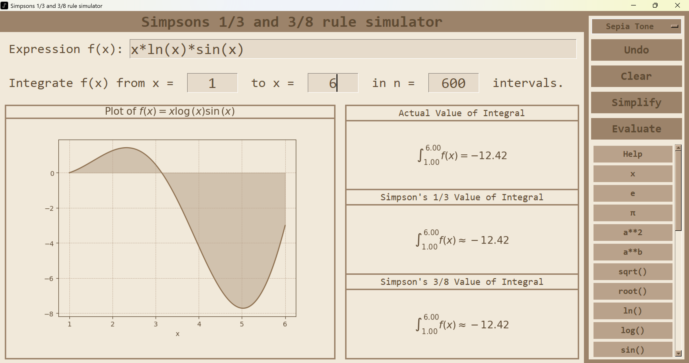

# Simpson’s Integration Simulator


**Simpson’s Integration Simulator** is a Python GUI application built with **Tkinter** that lets you **compute and visualize numerical integration** using **Simpson’s 1/3 rule** and **Simpson’s 3/8 rule**.  
It provides an interactive interface for entering mathematical expressions, simplifying them symbolically, and plotting both **exact** and **approximate** integral results.

---

## Features

- **Evaluate mathematical expressions** involving `x`
- **Compute definite integrals** using:
  - Simpson’s **1/3 Rule**
  - Simpson’s **3/8 Rule**
- **Visualize** functions and integral approximations
- **Simplify expressions** and view them in **LaTeX** format
- **Multiple themes** for a personalized look
- **Interactive buttons** for common math operations and functions
-  **Undo / Clear** support for easy correction

---

## Supported Functions

| Category | Supported Syntax |
|-----------|------------------|
| **Arithmetic** | `+`, `-`, `*`, `/`, `**` |
| **Trigonometric** | `sin(x)`, `cos(x)`, `tan(x)`, `csc(x)`, `sec(x)`, `cot(x)` |
| **Inverse Trigonometric** | `asin(x)`, `acos(x)`, `atan(x)`, `acsc(x)`, `asec(x)`, `acot(x)` |
| **Exponential & Logarithmic** | `e`, `π`, `ln(x)`, `log(x)`, `sqrt(x)`, `root(x, n)` |
| **Calculus** | `diff(f, x)`, `limit(f, x, a)`, `integ(f, x)`, `Sum(expr, (x, a, b))`, `Prod(expr, (x, a, b))` |

---

## How to Use

1. **Enter a function** of `x` in the input box.  
   Use the on-screen buttons for operators and functions. (See `Help` for examples.)

2. **Input limits and intervals**:
   - `a`: lower limit  
   - `b`: upper limit  
   - `n`: number of intervals  
     - Must be **even** for Simpson’s 1/3 rule  
     - Must be a **multiple of 3** for Simpson’s 3/8 rule  

3. **Simplify the function** using the `Simplify` button to see a symbolic preview and plot.

4. **Evaluate the integral** using the `Evaluate` button.  
   The app will display:
   - Exact integral value (from symbolic integration)
   - Approximation via Simpson’s 1/3 rule
   - Approximation via Simpson’s 3/8 rule

5. **Improve accuracy** by increasing `n`.

6. **Other options:**
   - `Undo`: Revert the last expression edit.  
   - `Clear`: Reset graphs and text boxes.  
   - `Theme`: Switch between available color themes (top-right dropdown).

---

## Installation

### 1. Clone the repository
```bash
git clone https://github.com/TirthrajSG/Simpsons-Integration-Rules.git
cd Simpsons-Integration-Rules
```

### 2. Install dependencies
Using the provided file:
```bash
pip install -r requirements.txt
```
Or manually:
```bash
pip install pillow matplotlib numpy sympy markdown tkinterweb
```

### 3. Run the application
```bash
python main.py
```

---

## Project Structure
```
Simpsons-Integration-Rules/
├── main.py                # Main Tkinter GUI application
├── theme.py               # Theme definitions for GUI (colors, fonts, etc.)
├── imgs/                  # Images used in the app and markdown files
│   ├── cover.png          # Cover image for the README.md
│   ├── icon.ico           # Icon for the Tkinter window
├── help.md                # Markdown file with app instructions or help
├── requirements.txt       # Python dependencies
└── README.md              # Project overview and instructions
```

---

## Dependencies

| Package | Purpose |
|----------|----------|
| **tkinterweb** | For rendering Markdown and help documentation inside Tkinter |
| **Pillow** | Image and icon handling |
| **matplotlib** | Plotting graphs and visualizations |
| **numpy** | Numerical calculations |
| **sympy** | Symbolic computation and integration |
| **markdown** | Converts help text into HTML |

---

## Preview

#### *Simpson’s Integration Simulator in action:*


---

## 🧑‍💻 Author

**Tirthraj S. Girawale**  
B.Stat. (Hons.), ISI Kolkata  

---